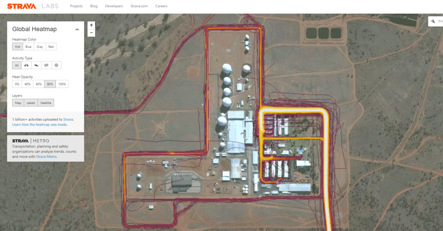

# FreeRun
## Self-hosted sport activity tracker

---

## Problem

Many people use activity trackers to record their workouts.
However, most tracker providers monetize user data as an additional revenue stream:

- Your workout data is sold to cities, researchers, and commercial partners
- Activity patterns enable targeted advertising based on your routes and habits
- This creates privacy risks—your home location, daily routines, and health data

---

## You can find secret military bases via Strava

---

## But: People still like to brag about their workouts!

---

## Solution

A self-hosted sport activity tracker with a possibility to share your workouts to selected hosts.

---

## Application

- Front-end, preferably a mobile app 
- A self-hosted back-end application 

---

## MVP

We can start with this functionality:

- Manual workout upload or an integration with existing service
- Workout details
- Workout broadcasting
- Friends activity boards
- Likes and comments ❤️

---

## We can scale it!

- Workout tracking for running and cycling using the front-end application
- Add more sport activities
- Add gear tracking
- Add statistics, e.g. PRs, trends

---

