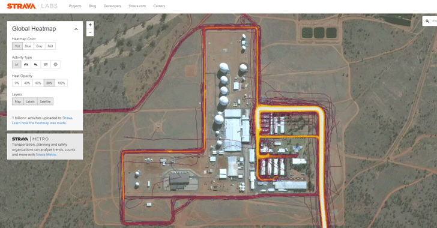

# FreeRun
## Self-hosted sport activity tracker

---

## Problem

Many people use activity trackers to record their workouts.
However, most tracker providers monetize user data as an additional revenue stream:

- Your workout data is sold to cities, researchers, and commercial partners
- This creates privacy risks—your home location, daily routines, and health data
- Activity patterns also enable targeted advertising based on your routes and habits

There are privacy risks too without sharing data to the 3rd parties!

---

## You can find secret military bases via Strava

---

## Possible solution

A self-hosted sport activity tracker where you keep your data only for yourself

---

## But: People still like to brag about their workouts!

---

## Solution

A self-hosted sport activity tracker with **a possibility to share your workouts** to selected hosts.

---

## High-level architecture

- Front-end, preferably a mobile app 
- A self-hosted back-end application 

---

## MVP

We can start with this functionality (ordered by prio):

- Manual workout upload or an integration with existing service
- Workout detail dashboard
- Workout broadcasting: sharing of workouts to selected hosts
- Activity feed: a log of your and friends' workouts
- Likes and comments ❤️
- Workout tracking for running and cycling using the front-end application

---

## We can scale it!

- Add more sport activities
- Add gear tracking
- Add statistics, e.g. PRs, trends

---

