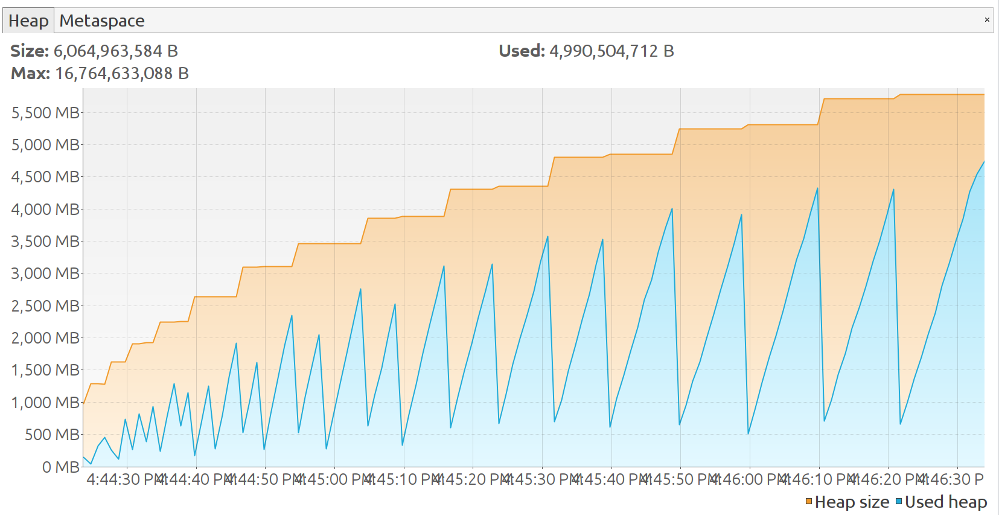
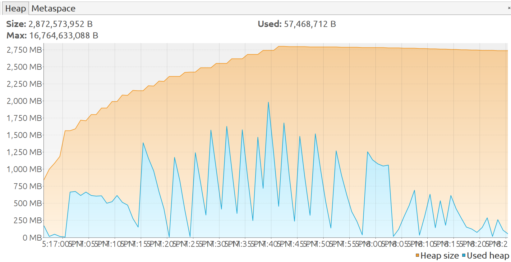
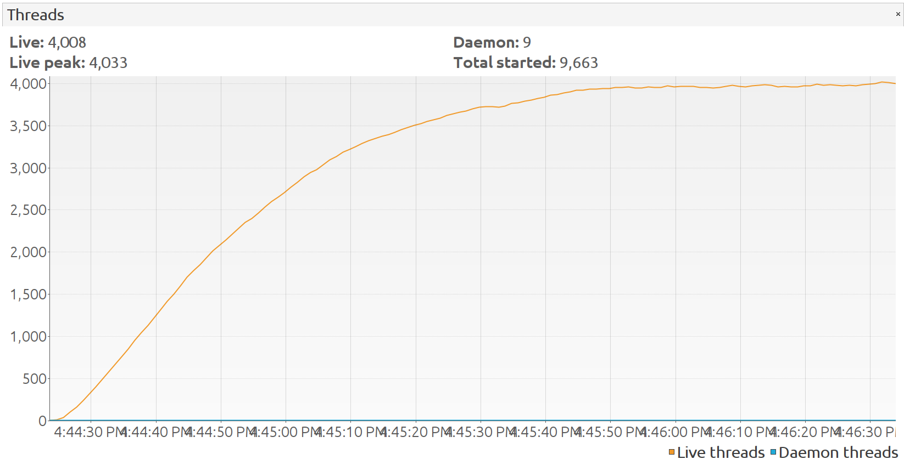
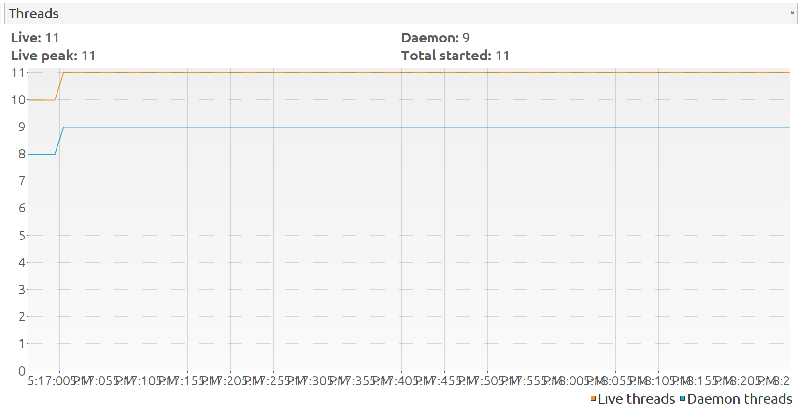
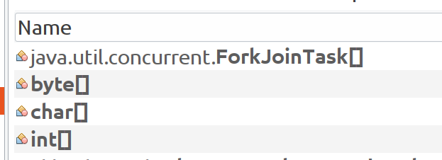

# **BDD tests memory leak**

## ...or yet another way to crash Jenkins👨

---

## **The Problem**

* The StreamTeam CI-pipelines started to stuck on a daily baisis
* It happened because of sudden crashes of the Jenkins node

---

## **First findings**

* The Jenkins node crashes when it builds the saved searches service application
* The saved searches service builds stuck while running the BDD tests

---

## **About the saved search service**

* A Scala application
* Uses Axon framework
* BDD tests are implemented using Cucumber🥒

---

## **Investigation begins🕵️**

**The plan:**
1. Run the BDD tests of the saved seach service locally with a running profiler
2. Compare the result with other Scala application

---

## **The leak is confirmed ✔️**



---

## **...and no memory leak for the other app**



---

## **The number of threads is suspiciously high**



---

## **...and only 11 threads for the other app**



---

## **Huge number of virtual threads**



---

## **Investigation continues🕵️**

1. Disable the tests one by one to find the problematic ones
2. **Findings:** The memory leak occur on the tests with injected Akka actor systems

---

## **About Cucumber 🥒**

It allows to write a human-readable specifications for features (even managers can read it!😯) using *Gherkin*

```
Feature: manage contract types
  As a job seeker
  I want to add my contract types to my profile
  So that I can receive job suggestions that match my desired contract type

Scenario: Cannot change contract types to value other than whitelist
    Given I have a profile
    When I change my contract types to "Ebenezer"
    Then I am notified that this contract type is invalid
```

---

## **About Cucumber 🥒**

A specification consist of scenarios:

```
Scenario: Cannot change contract types to value other than whitelist
    Given I have a profile
    When I change my contract types to "Ebenezer"
    Then I am notified that this contract type is invalid
```

---

## **About Cucumber 🥒**

For each scenario we define steps:

1. **Given** I have a profile
2. **When** I change my contract types to "Ebenezer"
3. **Then** I am notified that this contract type is invalid

---

## **About Cucumber 🥒**

Each step must be matched to a code block called *step definition*

In Gherkin:

```
    When I change my contract types to "Ebenezer"
```

In Scala:

```
  When("""^I change my contract types to "([^"]*)"$""") {
    ...
  }

```

## **About Cucumber 🥒**

Cucumber initialize **all the step definitions** for for each scenario to find the matches!

---

## **The case is solved🕵**

1. We hava an Akka actor system in a step definition
2. We have more than 100 BDD test scenarios
3. The actor system is initialized per each scenario
4. Jenkins crashes 👨🔫

---

## **Short term solution**

Make the Akka actor system volatile to prevent it re-initialization per each scenario

---

## **Long term solution**

Rewrite the BDD tests to unit-tests:

* They make it easy to shoot yourself in the foot
* We don't use advantages of the BDD apoach (managers don't read the code)
* It's harder to implement them

P.S.: The pipeline runs became ~2min shorter after the refactoring

---

## **Lessons learned**

* Be careful with alocating heavy instances in tests
* *"Finish what you start"*, deallocate a resourse after stop using it

---


