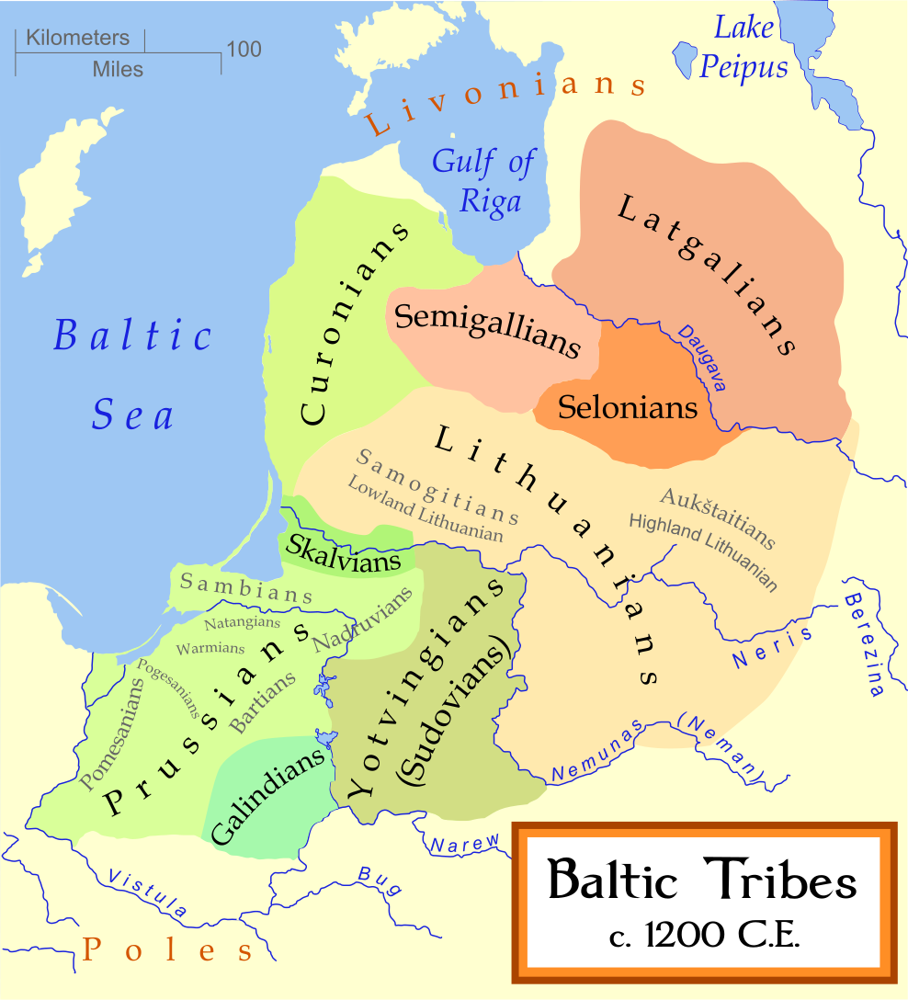

# Latvia 🇱🇻

---

## Agenda

- Quick facts
- Difference between the Baltic states
- History of Latvia
- Fun facts

---

# Quick facts 🚀

---

## Quick facts

- **Capital:** Riga
- **Area:** 64,589 km² (The Netherlands: 41,865 km²)
- **Population:** 1,842,226 (The Netherlands: 17,933,600)
- **The highest point:** 311.6 meters (The Netherlands: 321 meters)

---

## Quick facts

- **Average temperature in summer:** +19°C
- **Average temperature in winter:** -6°C

---

# Difference between the Baltic states 🇱🇹🇱🇻🇪🇪

---

---

# History 📜

---

---

---

---

---

---

---

---

---

---

---

---

---

---

---

---

---

---

---

---

---

---

---

---

---

---

---

---

---

---

---

---

---

---

---

